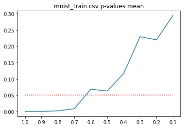
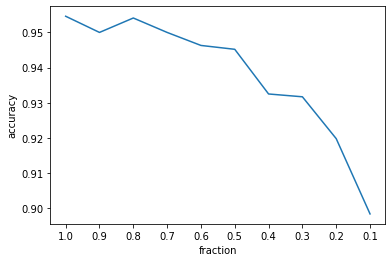

# DataChecker

### The tool that checks if the dataset is a population-representative sample

Sampling is used in statistical analysis methodologies to gain insights and observations about a population group. Thus  population representative sample is a necessity for obtaining insights and observations about a targeted population group. There are several techniques on how to subsample a dataset in order to obtain a population representative sample.

However, it is hard to evaluate existing dataset, whether the sample is representative. Most (if fact any) dataset is a subset of an arbitrarily large array of existing data samples. Thus any dataset can be biased towards certain properties.

Here, a tool to check dataset quality is presented. The tool is based on the multidimensional [Kolmogorov-Smirnov test](https://link.springer.com/article/10.1007/BF02865912). It can be assumed that once a data set is population representative, then adding more random data samples will not affect the distribution. Thus, from the opposite, randomly subsampling the dataset that is population representative will not affect the distribution.

In this case null hypothesis proposes that the dataset and it's random subset of a certain size are of the same distribution.  The size of the subset is gradually reduced until the moment when the hypothesis is rejected.


As an example for [MNIST](http://yann.lecun.com/exdb/mnist/) dataset null hypothesis is rejected when the subset of the training data is less than 70%:



At the same time testing accuracy rapidly reduces, when training set is less than 70%:



### How to use:

1. clone this repo

2. import single distribution test` (double distribution is still under construction):

```
from dataCheck import singleDistributionTest
```

3. place csv. file in data folder or set `path_in` and `path_out` parameters

4. call the function:

```
singleDistributionTest(path_in='./data',
                        path_out='./outputs',
                        adjusted_pvalue=False,
                        plot_all=False,
                        plot_legend = False
                        num_fractions = 10,
                        min_fraction = 0.1)
```
                        
 5. see if the p-value is flat and ideally near 0 on the beginning of the plot. Otherwise the dataset is most likely too small and/or unbalanced.

